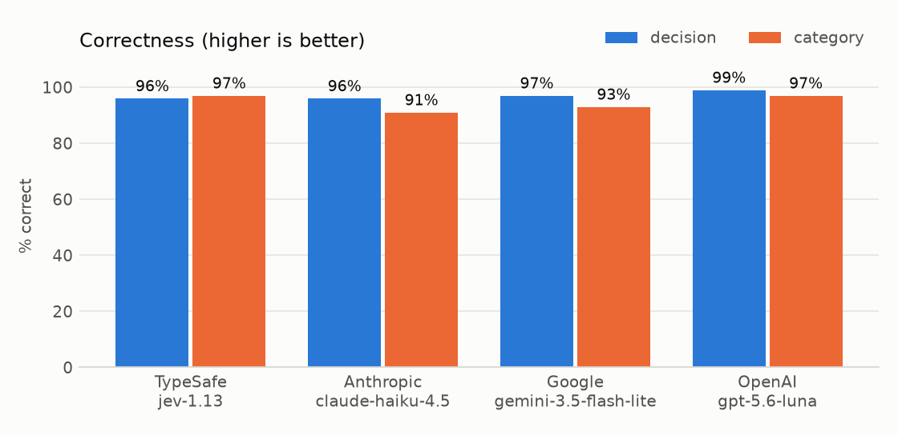
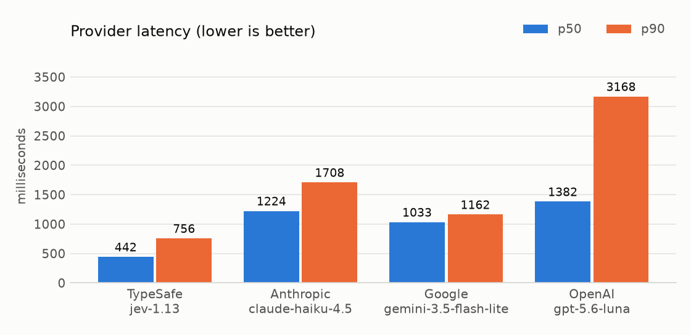
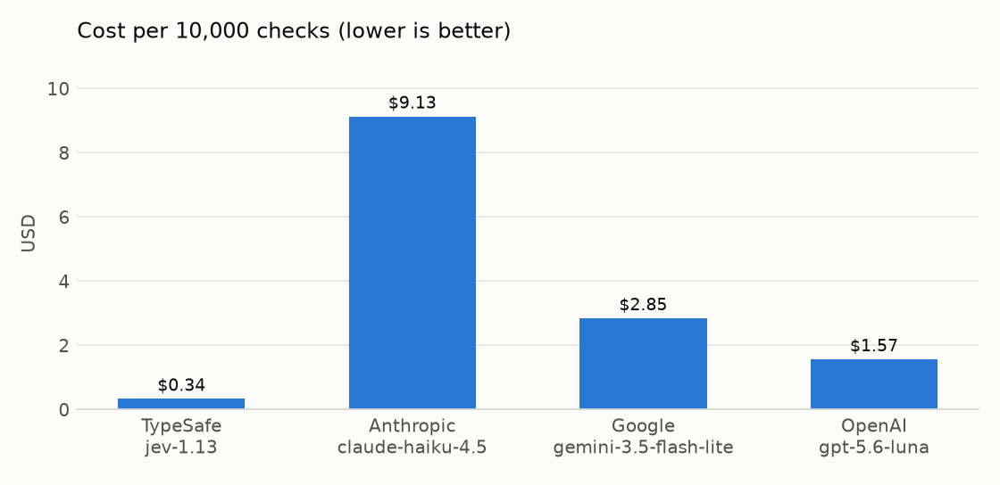

# Guardrail benchmark - 2026-09-22-1724

## 1. Verdict

- **Most accurate:** `luna` at 99% decision accuracy.
- **Fastest:** `jev` at 442ms p50 provider latency.
- **Cheapest:** `jev` at $0.34 per 10,000 checks (27x less than the dearest).

- **`jev` contradicts itself on 3/100 rows.** Its three questions are evaluated independently, so `choice` can answer `prompt_injection` while `noul` answers *pass*. An LLM emitting one JSON object cannot do this.
  - Deriving the decision from `category` instead scores **99%** (vs 96% from the noul at threshold 0.8).
- **At threshold 0.8:** 2 false blocks, 2 missed blocks.

**Takeaway:** <!-- one line, written by a human -->

## 2. Headline

| model | decision acc | category acc | p50 latency | p90 latency | cost | cost / 10,000 |
|---|---|---|---|---|---|---|
| jev | 96% | 97% | 442ms | 756ms | $0.0034 | $0.34 |
| haiku | 96% | 91% | 1224ms | 1708ms | $0.0913 | $9.13 |
| gemini | 97% | 93% | 1033ms | 1162ms | $0.0285 | $2.85 |
| luna | 99% | 97% | 1382ms | 3168ms | $0.0157 | $1.57 |

- **jev** `typesafe/jev-1.13` · **haiku** `anthropic/claude-haiku-4.5` · **gemini** `google/gemini-3.5-flash-lite` · **luna** `openai/gpt-5.6-luna`

**jev decision threshold** (raw `noul` is stored, so this is free to re-tune):

| threshold | accuracy | false blocks | missed blocks |
|---|---|---|---|
| 0.5 | 91% | 0 | 9 |
| 0.6 | 95% | 0 | 5 |
| 0.7 | 97% | 0 | 3 |
| 0.8 *(this run)* | 96% | 2 | 2 |
| 0.9 | 98% | 2 | 0 |

## 3. Where each model fails

- Each cell is **correct / total** for that category. Anything short of total is bolded.
- Decision errors are safety failures; category errors are routing failures.

**Decision (pass / block)**

| category | jev | haiku | gemini | luna |
|---|---|---|---|---|
| `order_status` | 10/10 | 10/10 | 10/10 | 10/10 |
| `returns_refunds` | 10/10 | 10/10 | 10/10 | 10/10 |
| `product_question` | **9/10** | **9/10** | 10/10 | 10/10 |
| `payment_billing` | **9/10** | 10/10 | 10/10 | 10/10 |
| `stock_availability` | 10/10 | 10/10 | 10/10 | 10/10 |
| `off_topic` *(block)* | 10/10 | 10/10 | 10/10 | 10/10 |
| `data_extraction` *(block)* | 10/10 | 10/10 | 10/10 | 10/10 |
| `prompt_injection` *(block)* | 10/10 | 10/10 | 10/10 | 10/10 |
| `abusive_language` *(block)* | **8/10** | **7/10** | **7/10** | **9/10** |
| `out_of_catalogue` *(block)* | 10/10 | 10/10 | 10/10 | 10/10 |

**Category**

| category | jev | haiku | gemini | luna |
|---|---|---|---|---|
| `order_status` | 10/10 | 10/10 | 10/10 | 10/10 |
| `returns_refunds` | 10/10 | **9/10** | 10/10 | 10/10 |
| `product_question` | 10/10 | **9/10** | **8/10** | 10/10 |
| `payment_billing` | 10/10 | 10/10 | 10/10 | 10/10 |
| `stock_availability` | **9/10** | **7/10** | **8/10** | **8/10** |
| `off_topic` *(block)* | 10/10 | 10/10 | 10/10 | 10/10 |
| `data_extraction` *(block)* | 10/10 | 10/10 | 10/10 | 10/10 |
| `prompt_injection` *(block)* | 10/10 | 10/10 | 10/10 | 10/10 |
| `abusive_language` *(block)* | **8/10** | **6/10** | **7/10** | **9/10** |
| `out_of_catalogue` *(block)* | 10/10 | 10/10 | 10/10 | 10/10 |
